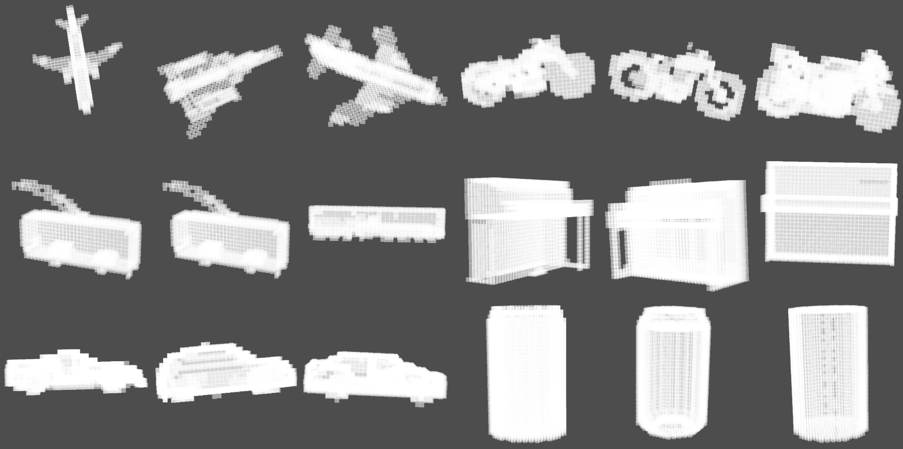

構成
０タイトル
１概要（画像をと一緒に）
２手法
３実験（データセット・学習方法）

# 確率微分方程式とスコアマッチングによる3Dオブジェクトの生成

私、塚上賢太が学部４年の卒論発表で行った研究になります。

当時はメタバースが話題になり始めたころであり、ウェブ会議・住宅展示場・イベントなど様々なメタバースサービスが出現していました。

そんな中で今後どんどんメタバースサービスが増えていくだろうと予測しました。

しかしながらメタバースサービスを制作するのには大量の3Dオブジェクトが必要でとてもコストがかかります。このコストはメタバース普及の足かせになりうると考えました。

そこで私は誰もが簡単に3Dオブジェクトを生成できるAIを開発したいと考えこの研究に至りました。

## 手法

